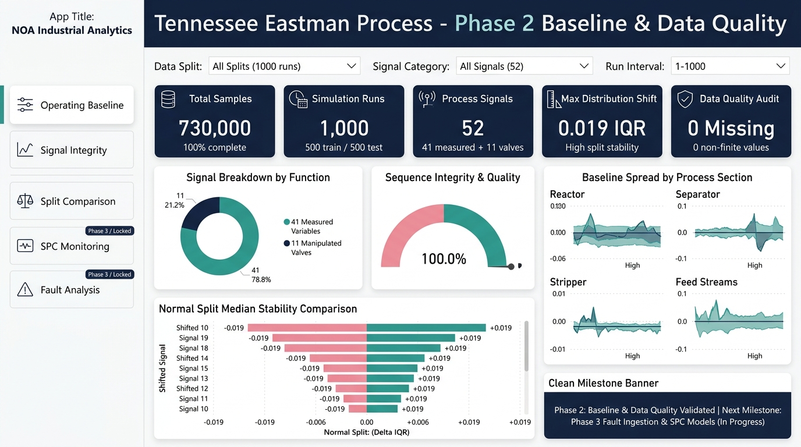
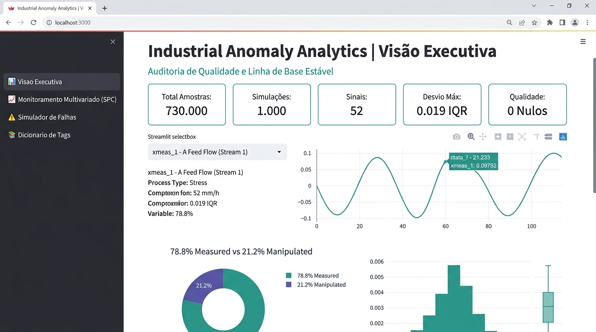
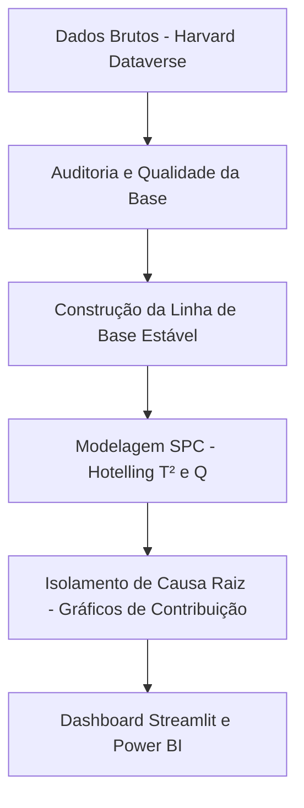

# [Detecção de Anomalias em Processos Industriais](https://github.com/Nayanearaujo/Industrial-Process-Anomaly-Detection-Multivariate-SPC-DuckDB-Python)

**Um framework analítico industrial que transforma dados de sensores de alta frequência em um plano de monitoramento estatístico de processos, auditado e pronto para a tomada de decisão operacional.**

[](https://www.python.org/)
[](https://duckdb.org/)
[](https://duckdb.org/)
[](https://github.com/Nayanearaujo/Industrial-Process-Anomaly-Detection-Multivariate-SPC-DuckDB-Python)
[](https://www.docker.com/)
[](https://powerbi.microsoft.com/)
[](https://parquet.apache.org/)
[](https://docs.pytest.org/)

Este projeto analisa o dataset do *Tennessee Eastman Process* utilizando um stack de **Python, SQL, Docker, Streamlit e Power BI**. O escopo cobre desde a auditoria da base de dados física (*raw signals*), validação da consistência estatística da operação normal, detecção de anomalias por modelos multivariados (SPC), até a modelagem dimensional de KPIs e o design de um plano de controle contínuo baseado em DMAIC.

---

## 📊 Dashboards Executivos e Aplicação Interativa

### 1. Painel Executivo Power BI (Visão Estratégica & Baseline)


### 2. Aplicação Interativa Streamlit (Visão Operacional & Simulações)


> **🚀 Experimente a Aplicação Interativa Web (`app.py`):**
> O web app oferece exploração interativa dos 52 sinais de processo com gráficos Plotly, simulador multivariado de SPC ($T^2$ e $Q$), injeção de falhas com regra de persistência e dicionário completo de instrumentação.
> ```bash
> # Executar localmente
> streamlit run app.py
> 
> # Ou executar 100% containerizado via Docker (porta 8501)
> docker compose up streamlit --build
> ```

---

## 🛠️ Tech Stack e Habilidades
Este repositório é um case de **Analytics Engineering & Industrial Data Science** focado em confiabilidade e integridade de dados operacionais:

- **Python (Pandas, NumPy, Plotly, Scikit-Learn):** Pipelines de ETL para conversão de séries temporais para Parquet, análise multivariada e modelagem SPC via PCA.
- **Streamlit:** Aplicação analítica interativa com simulador de limites de controle, injeção de falhas e gráficos dinâmicos em Plotly.
- **SQL (DuckDB):** Modelagem e criação de views de KPIs analíticos para consumo no Power BI.
- **Docker & Docker Compose:** Containerização do ambiente completo para execução isolada e reprodutibilidade com um único comando.
- **Estatística Industrial:** Monitoramento multivariado via $T^2$ de Hotelling, resíduos $Q$ (SPE) e regras de persistência de alarme.
- **Business Intelligence (Power BI & Power Query):** Modelagem dimensional star schema, desenvolvimento de medidas em DAX para acompanhamento operacional e design de interface executiva.

## Status do Projeto (Milestones)

| Frente de Trabalho | Status |
|---|---|
| Mapeamento de Sensores e Contexto Físico (Define) | Completo |
| ETL e Engenharia de Parquet (Measure) | Completo |
| Higienização e Auditoria de Qualidade | Completo |
| Validação Estatística de Operação Estável | Completo |
| Containerização com Docker & Docker Compose | Completo |
| Modelagem de Controle Estatístico de Processo (SPC) | Completo |
| Aplicação Web Interativa (Streamlit App) | Completo |
| Ingestão e Diagnóstico de Falhas (Fase 3) | Em Andamento |
| Comparação de Modelos de Detecção | Planejado |

## Raio-X do Processo (Resultados de Base)
A base analítica foi validada e auditada, fornecendo a base histórica necessária para o estabelecimento de limites de controle estatístico confiáveis.

| KPI / Métrica | Resultado Auditado | Detalhe Técnico |
|---|---:|---|
| **Amostras Totais** | **730.000** | Leituras de tempo coletadas nas simulações |
| **Simulações de Operação** | **1.000** | Corridas completas de processo para treino e teste |
| **Sinais de Processo** | **52** | 41 variáveis medidas + 11 variáveis manipuladas |
| **Desvio de Distribuição** | **0,019 IQR** | Máximo desvio de mediana entre treino e teste |
| **Integridade de Dados** | **100%** | Zero células vazias, valores infinitos ou chaves duplicadas |

## Indicadores de Processo & Insights
1. **Monitoramento Multivariado:** Como identificar quando o processo sai do seu envelope operacional estável usando métricas unificadas?
2. **Tempo de Detecção:** Quão rápido conseguimos identificar uma falha no sistema após o seu início físico?
3. **Taxa de Alarme Falso:** Como minimizar alertas desnecessários durante a operação normal para não sobrecarregar os operadores?
4. **Isolamento de Causa Raiz:** Quais variáveis (pressão, vazão, temperatura) são as maiores causadoras de um desvio detectado?
5. **Carga de Alarme:** Quantos alarmes confirmados são gerados a cada 100 horas de operação?

## Pipeline de Inteligência (Workflow)



## Validação e Higienização de Dados
A consistência dos dados históricos é crítica para o controle estatístico. A auditoria de dados realizou as seguintes verificações automáticas:
- **Integridade de Chave:** Confirmação de que a combinação de `simulationRun` e `sample` é única.
- **Valores Nulos e Infinitos:** Varredura em todas as 52 colunas físicas para assegurar a inexistência de leituras falhas.
- **Comparação de Splits:** Teste estatístico de Kolmogorov-Smirnov para garantir que a partição de teste tem a mesma distribuição da partição de treino (limite de deslocamento máximo de 0,019 IQR respeitado).

## Arquitetura de Monitoramento (DMAIC)
O projeto é estruturado utilizando a metodologia DMAIC de melhoria contínua:
- **Define:** Mapeamento de problemas operacionais como atrasos de detecção e sobrecarga de alarmes falsos.
- **Measure:** Criação da linha de base de operação normal estável.
- **Analyse:** Identificação das falhas mais críticas e das variáveis físicas correlacionadas com cada desvio.
- **Improve:** Ajuste fino dos limites estatísticos e das regras de persistência (ex: 3 alarmes consecutivos para validar um desvio).
- **Control:** Publicação de views em SQL, dicionários de KPIs, web app em Streamlit e painéis de resposta operacional para a sala de controle.

## Estrutura do Repositório
```text
Industrial-Process-Anomaly-Detection-Multivariate-SPC-DuckDB-Python/
├── config/                  # Paletas visuais e configurações
├── data/                    # Dados locais (raw, interim e processed)
├── docs/                    # Especificação de KPIs, dicionário e charter
├── images/                  # Gráficos exportados para documentação
├── notebooks/               # Roteiro de notebooks executáveis (01 a 03)
├── powerbi/                 # Arquivo de modelo e layout de dashboard
├── scripts/                 # Scripts Python de download, ETL e dimensões
├── sql/                     # Banco DuckDB e views de KPIs
├── src/                     # Módulos Python reutilizáveis
├── tests/                   # Testes unitários e de integridade
├── app.py                   # Aplicação interativa Web (Streamlit)
├── Dockerfile               # Imagem Docker para execução reprodutível
└── docker-compose.yml       # Orquestração analítica, Streamlit e Jupyter
```

## Roteiro de Análise (Notebook Roadmap)

| Ordem | Notebook | Objetivo |
|---|---|---|
| `01` | [01_data_source_and_process_context.ipynb](notebooks/01_data_source_and_process_context.ipynb) | Contextualização do processo químico, definição de variáveis e download. |
| `02` | [02_data_quality_and_operating_baseline.ipynb](notebooks/02_data_quality_and_operating_baseline.ipynb) | Auditoria de integridade física dos dados e validação do baseline estável. |
| `03` | [03_multivariate_statistical_process_control.ipynb](notebooks/03_multivariate_statistical_process_control.ipynb) | Modelagem SPC via PCA, cálculo de $T^2$ de Hotelling e resíduos $Q$. |

## Como Reproduzir o Projeto

### Opção A: Execução Containerizada com Docker (Recomendado)

Construa as imagens e execute os serviços containerizados:
```bash
# Iniciar o dashboard interativo Streamlit na porta 8501
docker compose up streamlit --build

# Iniciar o ambiente JupyterLab na porta 8888
docker compose up jupyter

# Gerar as tabelas dimensionais Parquet
docker compose up analytics
```

### Opção B: Execução Local (Python)

```bash
git clone https://github.com/Nayanearaujo/Industrial-Process-Anomaly-Detection-Multivariate-SPC-DuckDB-Python.git
cd Industrial-Process-Anomaly-Detection-Multivariate-SPC-DuckDB-Python
pip install -r requirements.txt

# Executar a aplicação Streamlit
streamlit run app.py

# Download do dataset
python scripts/download_data.py

# Processamento do baseline
python scripts/prepare_normal_baseline.py
```

## Ferramentas Utilizadas
Python · Streamlit · Pandas · NumPy · Plotly · Scikit-Learn · DuckDB · SQL · Docker · Parquet · Jupyter · Pytest · Power BI · GitHub

## Fonte e Licença
- **Dataset:** Tennessee Eastman Process Simulation Data (Harvard Dataverse, DOI: [10.7910/DVN/6C3JR1](https://doi.org/10.7910/DVN/6C3JR1)).
- **Licença:** Código sob [Licença MIT](LICENSE).

Desenvolvido por `Nayane Araujo`
